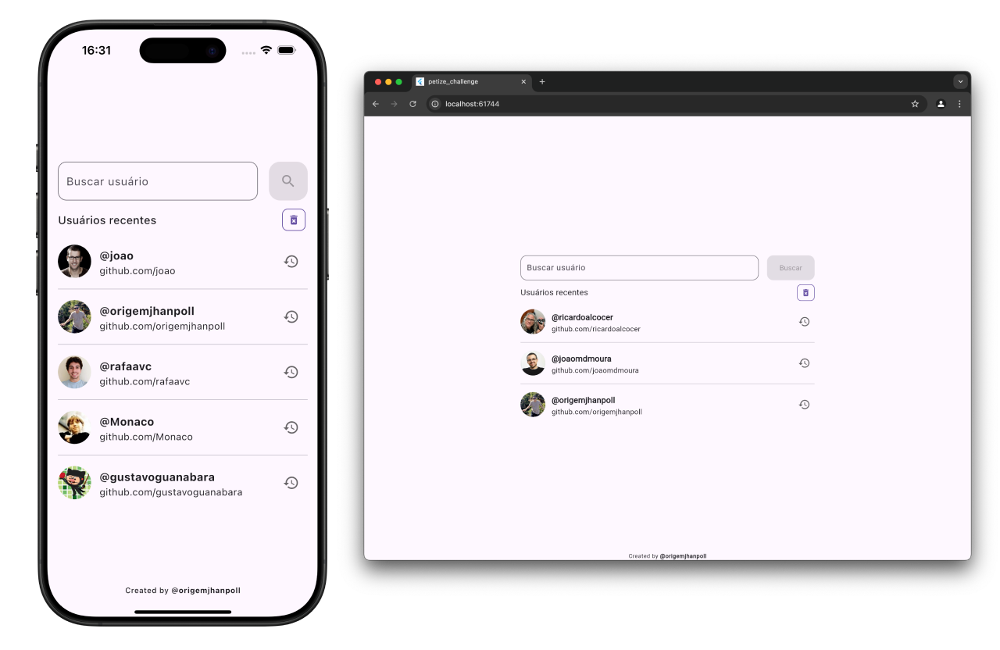
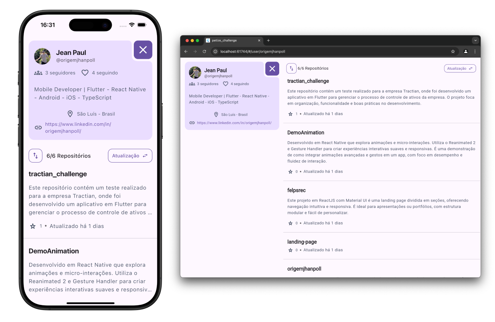

# petize_challenge

Este repositório contém o projeto "Petize Challenge", desenvolvido com Flutter. Siga as instruções abaixo para clonar, instalar dependências e rodar o projeto na sua máquina.

## Requisitos

Antes de rodar o projeto, certifique-se de que você tem o Flutter instalado. Caso não tenha, siga as instruções para instalação no link abaixo:

- [Instalação do Flutter](https://flutter.dev/docs/get-started/install)

## Passos para Rodar o Projeto

### 1. Clonar o Repositório

Clone este repositório na sua máquina local:

```dart
git clone https://github.com/origemjhanpoll/petize_challenge.git
```

### 2. Instalar as Dependências

Navegue até o diretório do projeto e instale as dependências:

```dart
cd petize_challenge
flutter pub get
```

### 3. Rodar o Projeto

Agora, basta rodar o projeto no seu dispositivo ou emulador:

```dart
flutter run
```

### Challenge document

🔗[Teste Dev Flutter - Petize](https://docs.google.com/document/d/1eALqfo_jloWZY7VyZDl1oo9tBp--RUEsS0OcllyJ73w/edit?tab=t.0#heading=h.5lhmderbskwj)

### Screenshots

Home screen

User screen


## Recursos utilizados

- Flutter Modular
- MediaQuery e Flex Widgets (Row, Column, Expanded e Flexible)
- WebView
- http
- Bloc
- local storage
- MVVM
